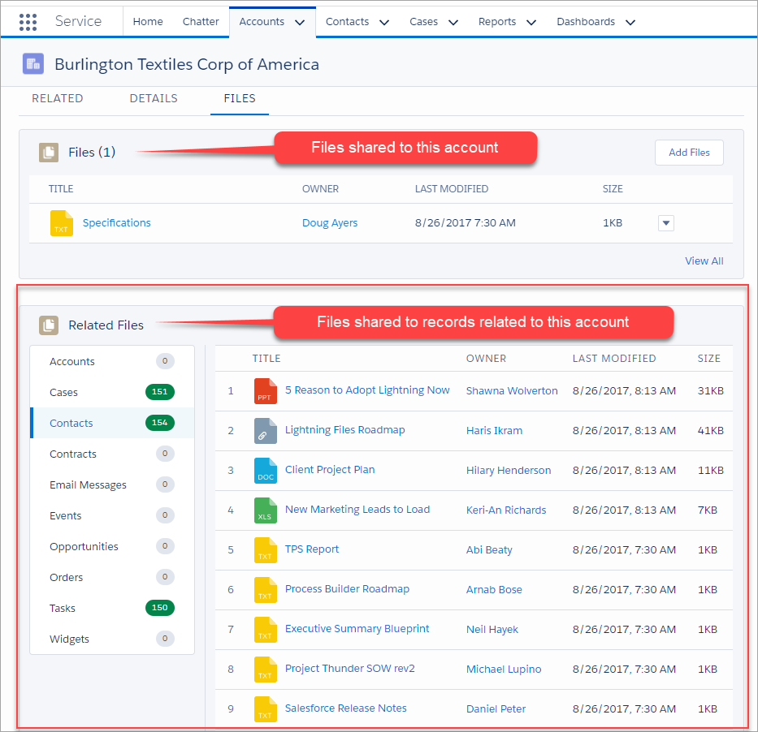
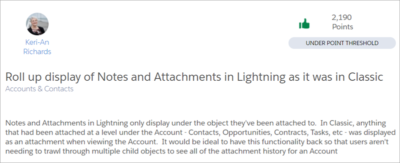
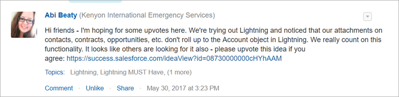
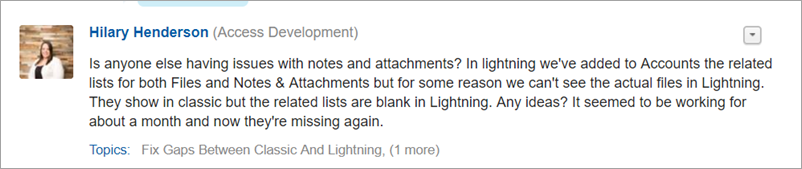
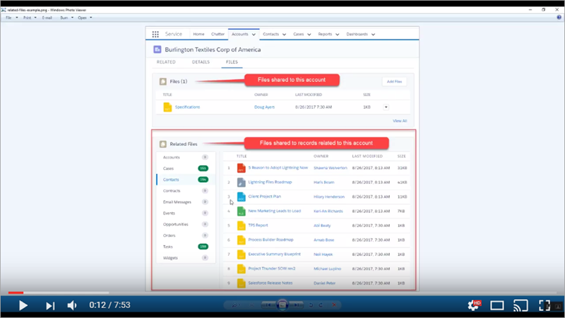

View Salesforce Files of Related Records
========================================

See files shared to all related records on one page in Lightning.

This project provides a Lightning Component you can drag on to your Lightning Record Pages in App Builder.

Background
----------

As of Summer '17 release, Lightning Files related list behaves fundamentally different than Classic Notes & Attachments related list
when it comes to showing files and attachments shared to not only to the current record but also shared to related child records.

When viewing the **Classic Notes & Attachments** related list on an account, for example, attachments belonging to the account
and its related contacts, cases, opportunities, tasks, etc. **are displayed** in one combined list.

When viewing the **Lightning Files** related list on the same account, for example, only the files explicitly shared to the account
are displayed. The files shared to its related contacts, cases, opportunities, tasks, etc. **are not displayed** in the same combined list.

This is a known limitation and by design according to this [help article](https://help.salesforce.com/articleView?id=000231874&type=1).

Community Requests
------------------

However, this "rollup" of Classic Attachments is a much beloved feature and customers are asking for it in Lightning Experience.

[Keri-An Richards](https://www.linkedin.com/in/keri-an-richards-44270810/) took to the IdeaExchange and submitted
[Roll up display of Notes and Attachments in Lightning as it was in Classic](https://success.salesforce.com/ideaView?id=08730000000cHYhAAM).

Others, like [Abi Beaty](https://success.salesforce.com/_ui/core/chatter/groups/GroupProfilePage?g=0F93A0000009SE1&fId=0D53A000037sJDC)
and [Hilary Henderson](https://success.salesforce.com/_ui/core/chatter/groups/GroupProfilePage?g=0F93A0000009SE1&fId=0D53A00003Bs5Tk),
have also inquired on the Success Community how to get this rollup feature in Lightning.

Seeing a need I began developing this app. After [sharing a sneak peek](https://twitter.com/DouglasCAyers/status/900277146668728320) on Twitter,
[Haris Ikram](https://twitter.com/HarisIkramH), Product Manager for Salesforce, commented that such a solution is in demand and happy to share this with the Salesforce Lightning Team. 

---

Packaged Release History
------------------------

Release 1.0 (current release)
-----------
* Install package
  * [Production URL](https://login.salesforce.com/packaging/installPackage.apexp?p0=04t1I000000h81H)
  * [Sandbox URL](https://test.salesforce.com/packaging/installPackage.apexp?p0=04t1I000000h81H)
* Initial managed package offering
* Shows all files, grouped by object, accessible by the user that are shared to related child records of the parent record.

Installing the Source Code (Developers)
---------------------------------------

You may install the unmanaged code from GitHub and make any desired adjustments. You are responsible for ensuring unit tests meet your org's validation rules and other requirements.

* [Deploy from Github](https://githubsfdeploy.herokuapp.com)

---

Getting Started
---------------

1. Add the [Files related list](https://releasenotes.docs.salesforce.com/en-us/winter16/release-notes/rn_chatter_files_related_list.htm) to your Page Layouts ([Trailhead Module](https://trailhead.salesforce.com/en/modules/lex_customization/units/lex_customization_page_layouts))

2. Add the **Related Files** custom Lightning Component to your Lightning Record Pages ([Trailhead Module](https://trailhead.salesforce.com/en/modules/lightning_app_builder/units/lightning_app_builder_recordpage))

Check out this 7 minute setup and how-to video:

Recommendations
---------------

* This component only works with Lightning Files, if you are still using Classic Attachments then I recommend that you [migrate them](https://github.com/DouglasCAyers/sfdc-convert-attachments-to-chatter-files).
* Add a new tab on your Record Pages labeled "Files" then add the standard `Related List` component (configured to show the **Files** related list) and my custom `Related Files` component.

---

FAQ
===

If one of your questions isn't answered below, please search and comment on [existing issues](/issues?utf8=%E2%9C%93&q=is%3Aissue) before opening a new one. Thanks! 

Which files are shown in the Lightning Component?
-------------------------------------------------

Files shared to child records that the user has access to.
A child record is any record found in one of the **related lists** of the main record being viewed.
For example, if viewing an account then the component could show you all files shared to contacts, cases, opportunities, etc. belonging to that account.

As a System Administrator, you may customize which related lists are visible in this component.
By default, all relationships accessible by the current user are displayed in the vertical navigation.

I don't see Attachments from related records like in Classic, what gives?
-------------------------------------------------------------------------

This component only works with Lightning Files, if you are still using Classic Attachments then I recommend that you [migrate them](https://github.com/DouglasCAyers/sfdc-convert-attachments-to-chatter-files).

---

Diclaimer
=========

I have only tested this in a Developer Edition org with a few hundred related records and files off one account.
If you have a much larger org with thousands of related records and files, please let me know how performance is
so I can make any adjustments if needed. Thanks!

Credits
=======

The Related Files Lightning Component is developed and maintained by [Doug Ayers](https://douglascayers.com).

License
=======

The source code is licensed under the [BSD 3-Clause License](LICENSE)